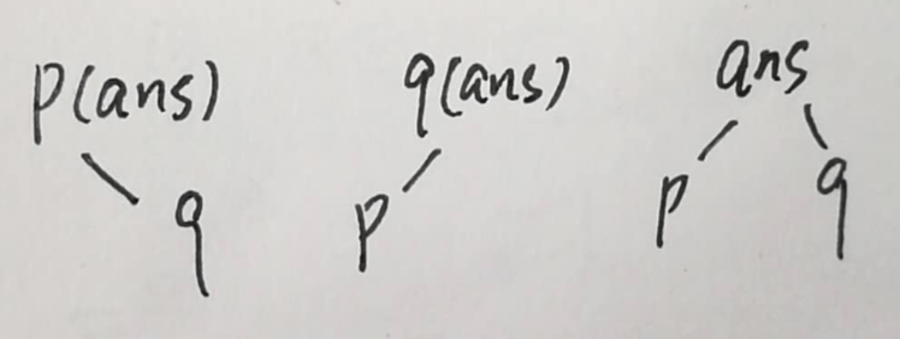

### #CODEUP1106 通信系统（http://codeup.cn/problem.php?id=1106）
判断一个无向图是否是一棵树（树的定义：各个顶点连通且没有环路的图）：
需要满足两个条件：
1、没有环：题目中“每个端点均不会重复收到消息”已经限定了不会出现环路。
2、各个顶点都连通：只需要计算连通块数，并判断连通分支数是否等于1？
树有一个性质：边数=点数-1；如果不满足此条件，也就不是一棵树。

### #LeetCode 952. Largest Component Size by Common Factor
1、一开始为了质数打表，TLE。之后改成对输入数组中每个数单独做factor decomposition。
2、并查集 + 计算每个union的大小。

### #LeetCode 926. Flip String to Monotone Increasing
TypeError: 'str' object does not support item assignment

### #PAT1032 Is It a Binary Search Tree （https://www.nowcoder.com/pat/5/problem/4082）
1、先序/后序/层序序列都可以唯一地确定一棵BST；
2、按原BST的先序序列插入得到的BST与原BST相同；按非BST的先序序列pre0插入得到的BST的先序序列pre1与pre0不同；
3、不同的插入顺序可能生成相同的BST，也可能生成不同的BST。
注：vector.size() 和 int 比较，显示type不匹配，改成(int)vector.size()

### #LeetCode 235. Lowest Common Ancestor of a Binary Search Tree
def lowestCommonAncestor(self, root, p, q）
记p,q的LCA为ans，则构成一棵以ans为根的子树，且p,q分别位于此子树的左右子树，下图表示出了p,q,ans的3种可能结构。此子树外的任何节点值要么大于both p&q，要么小于both p&q。因此要找的LCA(ans)即为binary search过程中遇到第一个 >=p && <= q 的节点。

